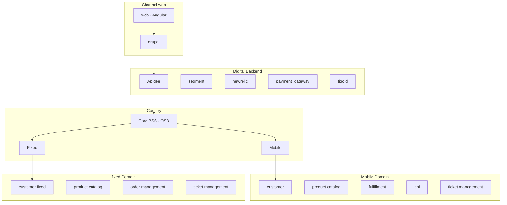

# Mi Tigo B2B (TBO)

**Journey**

Subscription B2B - Mobile + Home

**Description**

blab llbalb abala 

**Goals and KPIs**
- active users
- active companies
- invoices: pay
- nps

## Features
- autocreate user
- manage accounts: mobile+fixed accounts
- Discovery
    - Banner
- Use & Self-service
    - See Balances & Quota
    - Call History
    - Sms History
    - Internet details 
    - Balance Transfer
    - Renovations
    - Upgrade plans
    - Invoices
    - Pay multiple invoices with CC
    - Enable electronic bill (eco bill)
    - Invoice History
    - Download last invoice
    - Wifi self-service
        - change wifi password
        - change wifi name
        - reset modem
- Care & Recommendation
    - NPS
    - Help
        - chat
        - faq

## Basic architecture

## Implementation Details

### Authentication
- tigo id
    - TigoID Public

### Exposure layer
- apigee
    - Home Selfcare	
	- Kannel SMS	
	- Payment Domiciliation	
	- Selfcare API v2	
	- TBO-mobile self care	
	- Tigo BO Lend APIs	
	- Tigo Business Online BO	
	- Tigo Business Online CO	
	- Tigo Business Online GT	
	- Tigo Business Online HN	
	- Tigo Business Online SV	
	- Tigo Customer Support	
	- Tigo Mobile Product Fulfillment	
	- Tigo Mobile UpSelling Info	
	- Tigo Mobile Usage Balance	
	- Tigo SelfCare (LV1)	

### Engines / Enablers
- payment gateway
- zendesk

### Marketing tools
- kannel

### Repositories
- S3

### Other tools
- segment
- new relic
- tableau
    - dashboard tigo shop
    - active users
- analytics
    - mixpanel

## SOUTH ARCHITECTURE (COUNTRY)

