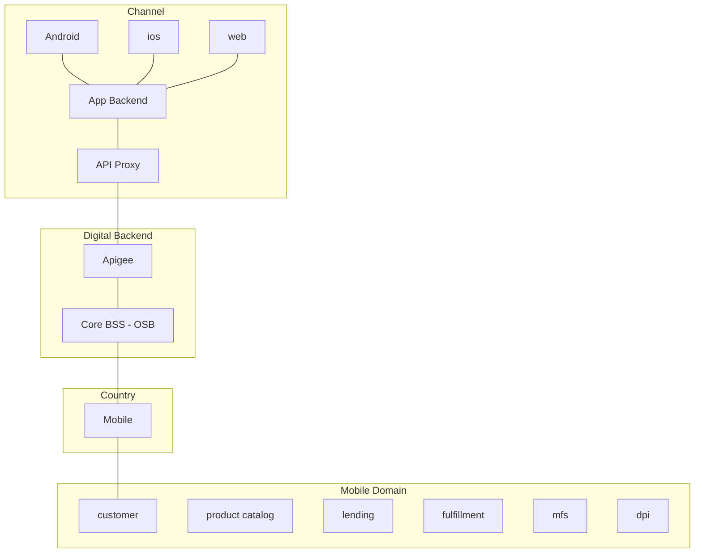

# Tigo Shop

**Journey**

Transactional - Mobile

**Description**

blab llbalb abala 

**Goals and KPIs**
- active users
- purchases
- loans
- nps

## Features
- Discovery
    - Banner
    - Push notifications
    - Product catalog
- Use & Self-service
    - Buy Pack
        - core balance
        - mfs
    - Loans
        - current debt & credit limit
        - loan balance
        - loan packs
    - Top-up
        - credit card
        - mfs
    - See Balances
    - See Quota
    - Manage subscriptions
    - Internet details
- Care & Recommendation
    - NPS
    - Help
        - chat
        - faq

## Basic architecture

## Implementation Details

### Authentication
- tigo id
    - TigoID Public

### Exposure layer
- apigee
    - Tigo Mobile Upselling Info
    - Tigo Lend APIs
    - Tigo Mobile Product Fulfillment
    - TigoMoney Payment
    - TigoMoney AccountStatusService
- kinesis

### Engines / Enablers
- payment gateway
- evam
    - lifecycle campaigns
    - broadcast
    - upselling (exacaster)
- zendesk

### Marketing tools
- digital turbine
- push notifications
    - pushwoosh
- kannel
- yourls
- attribution tools
    - tune
    - appflyer

### Repositories
- redshift
- BaaS
- Convergent DB
- S3

### Other tools
- segment
- new relic
- tableau
    - dashboard tigo shop
    - active users
- analytics
    - mixpanel
    - google analytics
    - facebook analytics

## SOUTH ARCHITECTURE (COUNTRY)

### Data services
- exacaster
    - nbo prepaid
    - nbo pospaid

